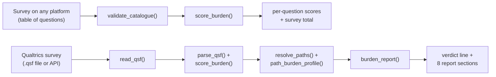

# surveyBurden

[](https://github.com/pmpk20/surveyBurden/actions/workflows/R-CMD-check.yaml)
[](https://lifecycle.r-lib.org/articles/stages.html#experimental)
[](https://opensource.org/licenses/MIT)
[](https://orcid.org/0000-0001-8550-466X)
[](https://app.codecov.io/gh/pmpk20/surveyBurden)

surveyBurden estimates how much response effort a survey instrument
requires. It scores every question with the GfS+ point scheme (extending
Heimgartner & Axhausen 2024). It can read a Qualtrics file directly and
follows its display logic to show how burden varies across the routes
respondents can take. If you have response data, the survey can also
tell you the burden per-respondent. surveyBurden is an independent
project with no affiliation with Qualtrics or any other survey platform,
and no platform provides support for it.

## Platform support

| Your survey                        | What surveyBurden gives you                                                                                                                                                                                                     |
|---------------------|-------------------------------------------------|
| **Any platform**                   | Per-question GfS+ scores and a survey total, from a simple table of your questions (`validate_catalogue()` then `score_burden()`); a burden range per route if you also list which questions each route shows (`path_burden()`) |
| **Qualtrics** (`.qsf` file or API) | All of the above, worked out automatically, plus the full report: routing and skip logic, burden across paths, respondent-level predictions, and analysis of response data and completion times                                 |

## Where to start

| What you have                                    | Start with                                    | What you get                                                           | Guide                                 |
|------------------|------------------|------------------|------------------|
| A survey on any platform, as a list of questions | `score_burden(validate_catalogue(catalogue))` | per-question scores and a total                                        | `vignette("extensions")`              |
| A Qualtrics survey (`.qsf` or API)               | `burden_report(qsf)`                          | a model-based structural burden profile across the survey's paths      | `vignette("reading-the-report")`      |
| That, plus respondent routes and loop counts     | `burden_report(qsf, routes = routes)`         | a distribution of respondent-level predicted burden                    | `vignette("paths-and-display-logic")` |
| A Qualtrics response export                      | `realised_burden(qsf, responses)`             | answer-based burden per respondent                                     | `vignette("realised-burden")`         |
| Completion times                                 | `validate_times(qsf, observed)`               | a check of predicted against observed time, and a survey-specific rate | `vignette("calibration")`             |
| A draft you want to make lighter                 | score it before and after an edit             | where the burden is, why, and how much a change removes                | `vignette("survey-revision")`         |

## Installation

surveyBurden is not on CRAN. Install the development version from
GitHub:

``` r
# install.packages("pak")
pak::pak("pmpk20/surveyBurden")

# or, with remotes:
# install.packages("remotes")
remotes::install_github("pmpk20/surveyBurden")
```

To work from a local clone, use
`pkgload::load_all("path/to/surveyBurden")` for one-off use, or
`R CMD INSTALL path/to/surveyBurden` to install it.

Dependencies: `jsonlite`, `cli` and `tibble`, plus `httr2` only if you
fetch from the Qualtrics API.

## Quick start

With a Qualtrics survey, one call gives the full report (this uses the
demo survey shipped with the package). Not using Qualtrics? See [Surveys
from other platforms](#surveys-from-other-platforms).

``` r
library(surveyBurden)

qsf <- system.file("extdata", "demo_travel_survey.qsf", package = "surveyBurden")
report <- burden_report(qsf)
report
```

```         
#> ── Survey Burden Report: Neighbourhood Travel Survey (demo) ────────────────────
#> Median completing path: 123 GfS+ points, ~10 min - 0.3x the benchmark median of
#> 399. Path burden ranges 106-143 points (9-12 min) across 2 completing paths.
#> ...
```

The full printout adds the instrument counts, the burden quantiles,
burden by block, the heaviest questions, readability diagnostics,
calculation certainty and QC warnings. `vignette("reading-the-report")`
walks through every section.

`summary(report)` prints just the headline:

``` r
summary(report)
#> ── Neighbourhood Travel Survey (demo) ──────────────────────────────────────────
#> 26 questions, 12 blocks, 4 structural paths (2 complete).
#> Median completing path: 123 GfS+ points, ~10 min - 0.3x the benchmark median of
#> 399. Path burden ranges 106-143 points (9-12 min) across 2 completing paths.
#> Benchmark: median 399 points across 79 GfS+-scored waves.
```

## Reading the report

`report` is a structured object, not printed text. Pull out each part:

``` r
report$instrument  # one-row tibble of the survey's structural counts
report$burden      # min / p25 / median / p75 / max, in points, minutes and index
report$items       # one row per question, with its GfS+ score and the rule used
report$paths       # one row per structural path, with its burden floor and ceiling
report$blocks      # burden totalled by block, in survey order
```

-   `report$instrument` --- questions, blocks, branch points, Loop &
    Merge blocks and structural paths.
-   `report$burden` --- the headline spread of **path burden** across
    the survey.
-   `report$items` --- every live question, its standard type, its point
    score, and a `score_flag` saying how the score was reached.
-   `report$paths` --- each structural path, whether it completes or
    screens out, and the burden range along it.
-   `report$blocks` --- question burden by block, with each block's
    share.

Scalar settings (the points-per-minute rate, the rare-value threshold)
are stored as attributes: `attr(report, "points_per_minute")`,
`attr(report, "rare_threshold")`.

Each printed section is explained in `vignette("reading-the-report")`.

## How it works



Both routes score questions with the same rules. For a Qualtrics survey,
`burden_report()` runs the whole pipeline; the lower-level functions
expose each step for inspection or reuse (see the reference table
below).

surveyBurden scores every question with the GfS+ point scheme (extending
Heimgartner & Axhausen 2024, Table 1), then follows the survey's flow
and display logic to work out which questions can appear together and
how burden varies across the structural paths the flow allows. The score
for one question is its **question burden**; the total along one route
is a **path burden**. The default result is a **structural burden
profile**: each complete path carries equal weight, and within a path
each modelled display-logic state does, so the reported "median" is the
middle value of that model-weighted distribution, not the burden half of
respondents exceed. Branch conditions are not checked against each
other, so the extremes are not guaranteed to be reachable by a real
respondent. Given real respondent route data, the report instead reports
a **population-weighted respondent burden**.

The package describes the instrument, not the respondent: it does not
claim that burden causes dropout, satisficing or slower responses. The
methodology is set out in `vignette("gfs-scoring")` and
`vignette("paths-and-display-logic")`.

## Fetching from Qualtrics

Set your credentials as environment variables, then pass a survey URL or
ID to `burden_report()`:

``` r
Sys.setenv(
  QUALTRICS_API_KEY  = "your-api-key",
  QUALTRICS_BASE_URL = "https://yourdatacenter.qualtrics.com"
)
burden_report("https://yourorg.qualtrics.com/survey-builder/SV_xxxxxxxxxxxxxxxx/edit")
```

Only the survey ID (`SV_...`) is needed, so a survey-builder link, a
distribution link (`.../jfe/form/SV_...`), or the bare `SV_` id all
work. `burden_report()` fetches the survey **definition**, not its
responses.

`QUALTRICS_BASE_URL` is the API datacenter host, which can differ from
your survey-builder host. Check Account Settings, then Qualtrics IDs.
Credentials are read from the environment and never appear in code.

You can only score a survey you can access. `burden_report()` reads the
survey **definition** through the `survey-definitions` API, which
requires a token with the "Manage Survey" permission on that survey ---
normally a survey in your own Qualtrics account. A public participation
link (`.../jfe/form/SV_...`) only lets a respondent *take* the survey;
it does not expose the definition. To score someone else's survey you
need either their `.qsf` export or an API token for the account that
owns it.

## Surveys from other platforms {#surveys-from-other-platforms}

The scoring rules do not depend on Qualtrics. Describe your questions in
a data frame -- one row per question, with its type and, where relevant,
its number of options, rows or columns -- and score it:

``` r
catalogue <- validate_catalogue(data.frame(   question_id = c("Q1", "Q2", "Q3"),   std_type    = c("single_choice", "matrix", "open_text"),   n_options   = c(5L, NA, NA),   n_rows      = c(NA, 4L, NA),   n_cols      = c(NA, 5L, NA) )) scored <- score_burden(catalogue) sum(scored$gfs_points)   # survey total, in GfS+ points
```

`validate_catalogue()` checks the table and fills in sensible defaults
for anything you leave out. The scores use exactly the same rules as for
a Qualtrics survey. If your survey has routing, list which questions
each route shows and `path_burden()` gives the burden range per route.
`vignette("extensions")` has the full column list, a worked example, and
what it would take for another platform's routing and skip logic to be
read automatically, as Qualtrics' are.

## Pipeline and API reference

`burden_report()` runs the whole pipeline. The lower-level functions
expose each step.

| function                                                    | output                                                                                            |
|------------------------------------|------------------------------------|
| `read_qsf(source)`                                          | internal survey object from a `.qsf` path, `SV_` id or URL                                        |
| `fetch_qsf(survey, api_key, base_url)`                      | the same object, fetched through the API                                                          |
| `parse_qsf(x)`                                              | question catalogue, one row per live question                                                     |
| `classify_question(payload)`                                | standard question type for one question                                                           |
| `gfs_scheme()`                                              | the GfS+ point scheme and the time conversion                                                     |
| `score_burden(catalogue, scheme)`                           | catalogue plus `gfs_points`, `score_flag`, `score_basis`                                          |
| `resolve_flow(qsf, max_paths)`                              | the distinct block sequences (structural paths)                                                   |
| `resolve_paths(qsf, max_paths)`                             | per path: questions always shown, may be shown, never shown                                       |
| `classify_reachability(catalogue, path_qids)`               | reachability label for each question on a path                                                    |
| `path_burden(qsf, scheme, max_paths)`                       | burden floor and ceiling per path                                                                 |
| `path_burden_profile(qsf, scheme, max_paths)`               | model-weighted burden values per path, from the enumerated display-logic states                   |
| `respondent_burden(qsf, routes, scheme, loop_typical)`      | population-weighted burden from observed routes                                                   |
| `summary_line(x, ...)`                                      | a one-sentence burden summary                                                                     |
| `calculation_certainty(qsf, scheme, max_paths)`             | which parts of the calculation are enumerated in full within the model and which are approximated |
| `burden_report(x, scheme, profile, routes, max_paths, ...)` | the structured report object                                                                      |
| `realised_burden(qsf, responses)`                           | per-respondent ex-post burden from response data                                                  |
| `validate_catalogue(catalogue)`                             | check and coerce a hand-built question catalogue                                                  |
| `validate_times(qsf, observed, scheme, trim)`               | a points-per-minute rate fitted to your completion-time data                                      |

Every function has a help page: `?burden_report`, `?score_burden`, and
so on. The guides cover the workflow end to end --- start with
`vignette("surveyBurden")`, then `vignette("reading-the-report")`,
`vignette("survey-revision")`, `vignette("gfs-scoring")`,
`vignette("paths-and-display-logic")`, `vignette("calibration")`,
`vignette("realised-burden")` and `vignette("extensions")`.

## Limitations

-   The mapping from question types to GfS+ points is sometimes
    inferential; the package applies a documented rule and flags the
    question.
-   The original GfS scheme predates modern web survey interfaces.
-   Rendered text length cannot be recovered exactly from a `.qsf`, so
    `words_per_line` is a configurable proxy.
-   Display-logic reconstruction depends on what the `.qsf` encodes;
    unusual or externally controlled logic may need manual
    interpretation.
-   The structural burden profile is not a respondent probability
    distribution.
-   The points-to-minutes conversion is a rule of thumb, not a
    completion-time forecast.

See `vignette("calibration")` for the detail.

## Contributing

Bug reports, questions and pull requests are welcome --- see
[`.github/CONTRIBUTING.md`](.github/CONTRIBUTING.md). Participants are
expected to follow the [Code of Conduct](CODE_OF_CONDUCT.md).

## Citation

`citation("surveyBurden")`, or see [`CITATION.cff`](CITATION.cff).

## Licence

MIT. Peter King, Institute for Transport Studies, University of Leeds.
